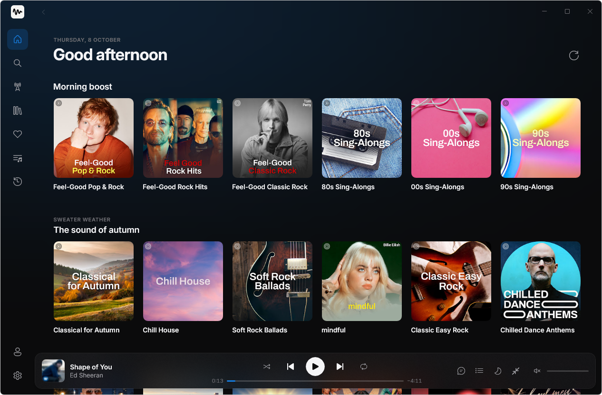
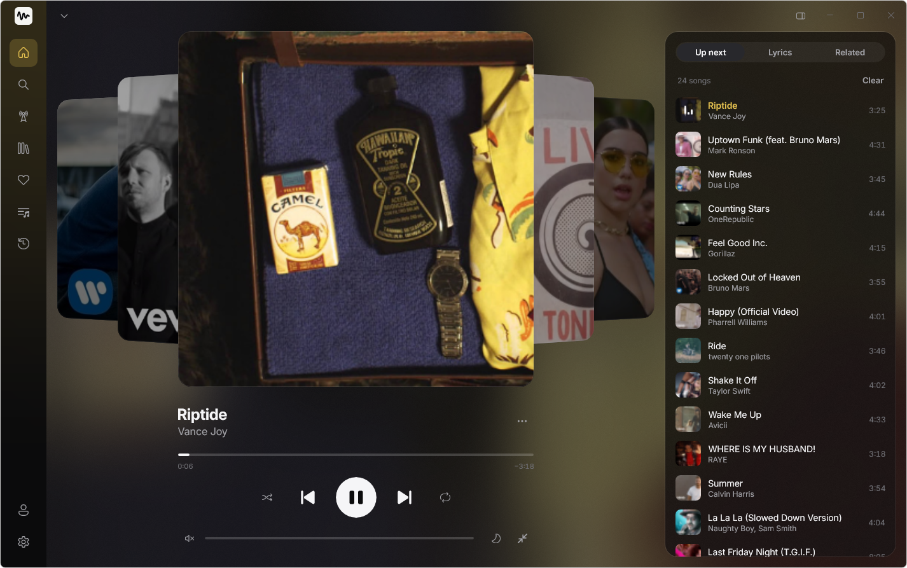
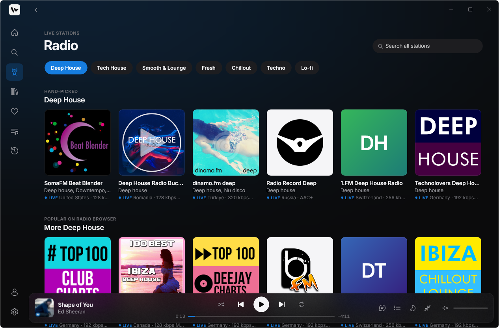
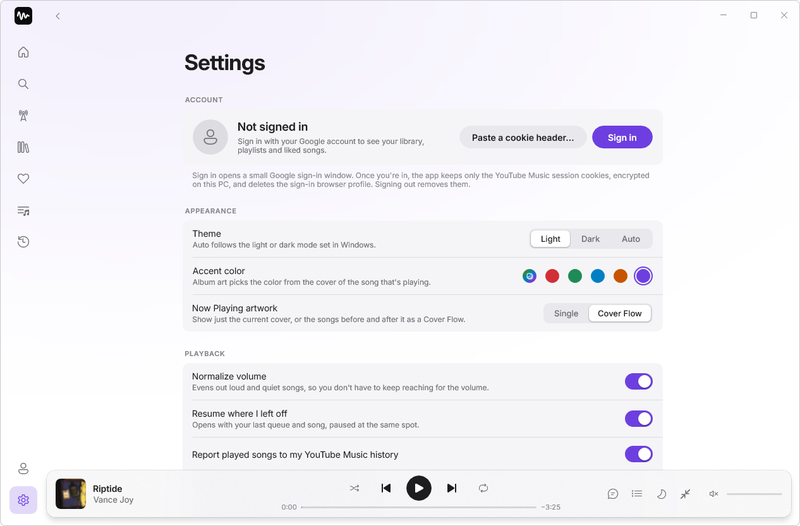
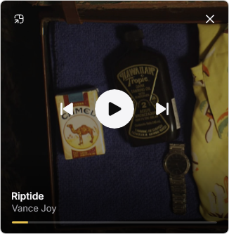
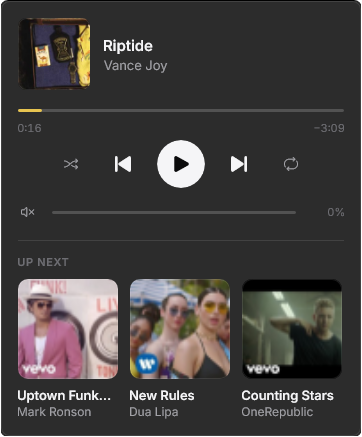

<p align="center">
  <picture>
    <source media="(prefers-color-scheme: dark)" srcset="docs/images/hush-lockup-on-dark.png">
    
  </picture>
</p>

<p align="center">
  A quiet, native Windows player for YouTube Music and live internet radio.
</p>

<p align="center">
  <a href="https://github.com/qblaize/HushMusic/releases/latest">Download</a> ·
  <a href="#features">Features</a> ·
  <a href="#privacy">Privacy</a> ·
  <a href="#faq">FAQ</a> ·
  <a href="#disclaimer">Disclaimer</a>
</p>

> [!IMPORTANT]
> Hush is an **unofficial** client. It is not affiliated with, endorsed or sponsored by Google LLC or YouTube. Read the
> [disclaimer](#disclaimer) before you sign in with your account.

Hush is a desktop app built with WinUI 3 and .NET. It talks to YouTube Music's own web API, plays audio with the
Windows media player and never shows a web page, except the Google sign-in window, which closes as soon as you're in.
It also plays live internet radio from thousands of stations, scrobbles to Last.fm and can put a small player on the
Windows taskbar.



| Now Playing with Cover Flow | Live radio |
|---|---|
|  |  |

| Settings (light theme) | Mini player | Taskbar player flyout |
|---|---|---|
|  |  |  |

## Features

**YouTube Music**

- Home with your recommendations and Quick picks, search with suggestions and filters (songs, albums, artists,
  playlists), album, artist and playlist pages.
- **Explore**: new releases, trending songs, moods & genres, and charts by country.
- Artist pages with **See all** for the full list of albums, singles and videos.
- Your library, playlists, liked songs and history once you sign in. Like and unlike songs, add them to playlists,
  create, rename and delete playlists. Changes go straight to your account.
- Start a radio from any song; radio and up-next queues keep topping themselves up.
- When an album or playlist ends, it keeps going with similar songs (you can turn this off).
- Save the current queue as a playlist.
- Edit your playlists: drag songs to reorder them, or select several (**Select**, or Ctrl/Shift-click) to play, queue,
  add to another playlist or remove them, with Undo.
- **Your stats** (Library → Your stats): top artists, songs and albums, listening time and when you listen, by week,
  month, year or all time. Kept only on this PC.
- Songs you play show up in your YouTube Music history, as they would in the official app (you can turn this off).
- Drag songs onto the queue, the player bar or a playlist.

**Now Playing**

- A full-window view with a large cover over a softly blurred copy of it, and **Up next** (drag to reorder),
  **Lyrics** and **Related** beside it.
- Synced lyrics when YouTube has them: the current line follows the song, and clicking a line jumps to it.
- **Cover Flow**: earlier and later songs stack behind the current cover and glide into place when the song changes.
  Click one to play it. Settings → Appearance → Now Playing artwork switches between Single and Cover Flow.

**Listening**

- **Crossfade** (up to 12 seconds) between songs; with crossfade off, the next song is preloaded so it starts without a gap.
- Volume normalization from YouTube's per-track loudness data.
- Resume where you left off: the queue, song and position come back, paused.
- Sleep timer (15 to 60 minutes, or the end of the song) with a fade-out.
- [Last.fm](https://www.last.fm) scrobbling with your own API key ([setup](#lastfm)).

**Live radio**

- A hand-picked grid per genre: Deep House, Tech House, Smooth & Lounge, Fresh, Chillout, Techno and Lo-fi.
- Search the whole [Radio Browser](https://www.radio-browser.info) directory, and keep favourites.
- Stations show a LIVE badge and the song on air. Next and Previous switch stations.
- Heard something you like? Click the song on air to find it on YouTube Music, then play it, queue it, like it or add
  it to a playlist. Now Playing keeps a list of what played on the station.

**Windows**

- Two designs: Hush's own, or the standard Windows 11 look (Mica, Segoe UI, stock controls). Settings → Appearance → Design.
- Light, Dark or Auto theme. The accent colour follows the album art, or pick one of five presets or your Windows accent colour.
- Standard or Minimal player layout. Minimal docks a simple player bar (cover, title, previous / play / next, volume) and keeps Now Playing to the cover and controls.
- Media keys and the Windows media flyout, taskbar thumbnail buttons and progress.
- Mini player: a small always-on-top window.
- Keep playing from the notification area when the window is closed, and start with Windows.
- Taskbar player (optional): cover, title and controls in the empty left part of the Windows 11 taskbar. Scroll over
  it to change the volume; click it for a flyout with seek, shuffle, repeat, like, volume and the next three songs.
  Show it on the main display, on all displays, or on one you choose.
- **Global shortcuts** (optional, rebindable): control playback, volume and likes from anywhere, even while Hush is
  in the background.
- **Song notifications** (optional): a silent notification with the cover and a Next button when a new song starts
  while Hush is in the background.
- Keyboard: <kbd>Space</kbd> play/pause, <kbd>Ctrl</kbd>+<kbd>←</kbd>/<kbd>→</kbd> previous/next,
  <kbd>Ctrl</kbd>+<kbd>F</kbd> search, <kbd>Alt</kbd>+<kbd>←</kbd> back, <kbd>Esc</kbd> closes Now Playing.

## Install

1. Open the [latest release](https://github.com/qblaize/HushMusic/releases/latest) and download the file whose name
   ends in **`-Setup.exe`**.
2. Run it. Hush installs for your Windows user only (no administrator rights) and starts.
3. The builds are not code-signed, so Windows SmartScreen may show **"Windows protected your PC"**. Select
   **More info**, then **Run anyway**. If you'd rather not, you can [build Hush from source](#build-from-source).

Requirements:

- Windows 10 version 1809 or later, or Windows 11, on an x64 PC.
- Nothing else to install: .NET and the Windows App SDK are included. On first run Hush downloads
  [yt-dlp](https://github.com/yt-dlp/yt-dlp) and [Deno](https://deno.com) from their official GitHub releases (it
  checks each file's SHA-256) and keeps both up to date.
- Playback uses WebM/Opus audio, which needs the Web Media Extensions. They come with Windows 10 and 11, but not with
  the N and LTSC editions, where you can install them from the Microsoft Store.

Hush updates itself from this repository's releases: it checks every 12 hours, downloads the update in the background
and installs it the next time you restart the app.

To uninstall, use Settings → Apps → Installed apps → Hush. Your settings and sign-in stay in
`%LOCALAPPDATA%\HushMusic`; sign out first, or delete that folder, to remove everything.

## Signing in

You don't have to sign in: without an account you can browse, search and play. Signing in adds your library,
playlists, likes and history.

Select the account icon at the bottom of the sidebar, or Settings → Account → **Sign in**. A small window opens
Google's own sign-in page. When it reaches music.youtube.com, Hush:

1. keeps only the YouTube session cookies,
2. encrypts them for your Windows user with DPAPI and stores them in `%LOCALAPPDATA%\HushMusic\secure\session.bin`,
3. closes the window and deletes its browser profile.

Hush never reads or stores your password, and the cookies are only ever sent to YouTube. **Sign out** deletes them.

If Google won't sign you in inside the embedded window, use **Paste a cookie header…** instead: sign in at
music.youtube.com in your normal browser, open the developer tools (<kbd>F12</kbd>) → Network, select any request to
`music.youtube.com/youtubei/…` and copy the value of its `Cookie` request header.

YouTube sometimes ends cookie sessions after a few hours or days. Hush then shows "Your session expired" and offers to
sign in again.

By default, finding a song's audio stream runs **without** your account, because yt-dlp warns that accounts used with
it can be rate-limited or blocked. If an age-restricted or account-only song won't play, you can turn on Settings →
Playback → **Use my account when resolving streams**.

## Privacy

Hush has no telemetry, no analytics and no servers of its own. (The Windows App SDK it runs on follows your Windows
diagnostic-data settings, like any WinUI app.) Your data stays on your PC, apart from what the services below need to
work:

| Connects to | When | What for |
|---|---|---|
| `music.youtube.com`, `s.youtube.com`, YouTube's image and media servers | Always | Pages, search, playback, likes and playlists; history reports (if enabled); album art; audio. |
| `accounts.google.com` | Only in the sign-in window | Google's own sign-in. |
| `github.com` | On first run, then now and then | Downloading and updating yt-dlp and Deno, and checking for Hush updates. |
| Radio Browser (`*.api.radio-browser.info`) and the stations you play | When you open Radio | The station directory, station logos and streams. Playing a station counts one "click" with Radio Browser, as its API asks. |
| `ws.audioscrobbler.com`, `last.fm` | Only if you connect Last.fm | Scrobbles and "now playing". |

## Where your data lives

Everything is in `%LOCALAPPDATA%\HushMusic`. The app itself is installed in `%LOCALAPPDATA%\HushMusic.App`.

| Path | What |
|---|---|
| `settings.json` | Your settings (nothing secret). |
| `secure\session.bin` | YouTube session cookies, encrypted with DPAPI for your Windows user. |
| `secure\secrets\*.bin` | Last.fm API key, shared secret and session, each encrypted with DPAPI. |
| `secure\tmp\` | A short-lived cookie file for yt-dlp, only while "Use my account when resolving streams" is on. Readable only by you and deleted as soon as yt-dlp exits. |
| `webview-signin\` | The sign-in window's browser profile, deleted after sign-in. |
| `cache\images\` | Album art (trimmed to 384 MB once it passes 512 MB). |
| `cache\streams.json` | Resolved stream links, reused until shortly before they expire (about 6 hours). |
| `cache\playback-session.json` | Last queue, song and position, for "Resume where I left off". |
| `cache\lastfm-queue.json` | Scrobbles waiting to be sent. |
| `cache\visitor_id.txt` | YouTube's anonymous visitor id (not a credential). |
| `radio-favorites.json` | Your favourite stations. |
| `history\plays-YYYY.jsonl` | Your listening log for **Your stats** (one line per play). Clear it from the stats page. |
| `tools\yt-dlp\<version>\`, `tools\deno\<version>\` | The app-managed yt-dlp and Deno. |
| `logs\hushmusic-*.log` | Daily log files, kept for 14 days. Settings → Diagnostics sets the level and opens the folder. |

## Last.fm

Settings → Last.fm. Create an API account at
[last.fm/api/account/create](https://www.last.fm/api/account/create) (any application name; leave the callback URL
empty), paste its **API key** and **shared secret**, select **Connect**, approve Hush in your browser, then select
**I've approved it**.

- A song is scrobbled once you've listened to half of it or 4 minutes, whichever comes first, and only if it is longer
  than 30 seconds. Radio stations are not scrobbled.
- Plays made offline are queued and sent later.
- **Disconnect** forgets the key, the secret, the session and any queued plays.

## FAQ

**Is this an official YouTube Music app?**
No. It's an independent, open-source project that uses the same web API as music.youtube.com. See the
[disclaimer](#disclaimer).

**Do I need an account?**
No. Signing in only adds your own library, playlists, likes and history.

**Could using Hush affect my Google account?**
It might. Hush makes the same kind of requests the web app makes, but it isn't an official client, and using it may be
against YouTube's Terms of Service. Google could limit or suspend accounts used with unofficial clients. To keep the
risk low, stream resolution runs without your account unless you turn that on.

**Does Hush download music?**
No. It streams audio the same way the web player does, while you listen. It doesn't save songs or let you export them.
The only things cached on disk are album art, the stream links themselves (not the audio) and your queue.

**Why does Hush download yt-dlp and Deno?**
yt-dlp finds the audio stream for each song, and it needs a JavaScript runtime (Deno) to solve YouTube's playback
challenges. YouTube changes often and old yt-dlp versions stop working, so Hush keeps both up to date itself rather
than shipping copies that would go stale.

**Songs don't play, or stop right away.**
Most often yt-dlp is out of date: Settings → Stream resolver (yt-dlp) → **Check for update**. On Windows N or LTSC,
install the Web Media Extensions. If it still fails, open an issue with the relevant lines from the log (Settings →
Diagnostics → **Open folder**).

**Google says the browser or app may not be secure.**
Google sometimes blocks sign-in inside embedded browsers. Use **Paste a cookie header…** (see
[Signing in](#signing-in)).

**Why does Windows say it protected my PC?**
The installer isn't code-signed, because a signing certificate costs money every year. Select **More info → Run
anyway**, or build it yourself from source.

**Is there a macOS or Linux version?**
No. Hush is built on WinUI 3, which runs only on Windows.

**Where do I report a problem or suggest something?**
In the [issue tracker](https://github.com/qblaize/HushMusic/issues). Please don't paste cookies or anything from the
`secure` folder.

## Build from source

You need Windows 10 1809+ or Windows 11, the [.NET 10 SDK](https://dotnet.microsoft.com/download) (10.0.201 or later)
and, for running from Visual Studio, Visual Studio 2026 with the WinUI application development workload.

```powershell
git clone https://github.com/qblaize/HushMusic.git
cd HushMusic
dotnet build HushMusic.slnx
dotnet run --project src/HushMusic.App
```

Or open `HushMusic.slnx` in Visual Studio and press <kbd>F5</kbd> (profile "HushMusic (Unpackaged)"). Development
builds run unpackaged and use the same data folder as an installed copy.

Run the tests (they use Microsoft.Testing.Platform, set in `global.json`):

```powershell
dotnet test --project tests/HushMusic.Core.Tests/HushMusic.Core.Tests.csproj
dotnet test --project tests/HushMusic.InnerTube.Tests/HushMusic.InnerTube.Tests.csproj
dotnet test --project tests/HushMusic.Playback.Tests/HushMusic.Playback.Tests.csproj
```

Building the installer, releases and the code conventions are in [CONTRIBUTING.md](CONTRIBUTING.md).

## How it works

```
src/
  HushMusic.Core/       models, interfaces, queue, playback actions, radio, Last.fm, features (no Windows UI)
  HushMusic.InnerTube/  YouTube Music's web API: HTTP client, API classes, one parser per page type
  HushMusic.Auth/       cookie sign-in, DPAPI storage, request signing (SAPISIDHASH), yt-dlp cookie file
  HushMusic.Playback/   yt-dlp and Deno management, stream resolution, MediaPlayer, media keys (SMTC)
  HushMusic.App/        WinUI 3 shell, pages, view models, mini player, tray and taskbar player
tests/
  HushMusic.InnerTube.Tests/  parser tests on saved real responses, HTTP request tests
  HushMusic.Core.Tests/       queue, playback actions, features, radio, Last.fm
  HushMusic.Playback.Tests/   yt-dlp and Deno management, stream resolution
```

There is no official YouTube Music API. Hush uses the private "InnerTube" API that music.youtube.com itself uses,
following the open-source Python library [ytmusicapi](https://github.com/sigma67/ytmusicapi) for every request and
response. Everything that depends on this unofficial API sits behind a few interfaces in one project, so when YouTube
changes something the fix stays in one place. More in [docs/ARCHITECTURE.md](docs/ARCHITECTURE.md), and the request and
parser details in [docs/innertube-requests.md](docs/innertube-requests.md) and
[docs/parsers-spec.md](docs/parsers-spec.md).

## Known limitations

- Real Google sign-in inside the embedded window can be blocked by Google; the cookie-header paste is the fallback.
- Radio song titles come from the station's ICY metadata, read over a short extra connection every 15 seconds (about
  10–30 % of the stream's bandwidth while a station plays). Shoutcast v1 servers show no titles, and HLS-only stations
  are left out.
- The taskbar player relies on an unsupported technique: Windows 11 has no API for adding to the taskbar, so Hush
  places a small window of its own inside it. A Windows update can break or misplace it. It works on horizontal
  taskbars only, and it keeps clear of other things on the left of the taskbar (turn off other taskbar media widgets
  rather than running both).
- "Start with Windows" uses the per-user Run key.

## Disclaimer

- Hush is an **unofficial**, independent project. It is **not affiliated with, endorsed or sponsored by Google LLC or
  YouTube**.
- "YouTube" and "YouTube Music" are trademarks of Google LLC. They are used here only to describe what Hush is
  compatible with.
- Hush doesn't download, store or redistribute any music or other content. It streams audio while you listen, the
  same way the official web player does. All music, artwork, lyrics and metadata belong to their respective owners.
- Using Hush **may be against YouTube's Terms of Service** and could affect your account. **Use it at your own risk.**
- Hush is free software, provided **"as is", without warranty of any kind**. See sections 15 and 16 of the
  [GNU General Public License v3.0](LICENSE).

## Licence

Copyright (C) 2026 qblaize — see [LICENSE](LICENSE).

Hush is free software: you can redistribute it and/or modify it under the terms of the GNU General Public License as
published by the Free Software Foundation, either version 3 of the License, or (at your option) any later version.
Third-party components and their licences are listed in [THIRD-PARTY-NOTICES.md](THIRD-PARTY-NOTICES.md).
